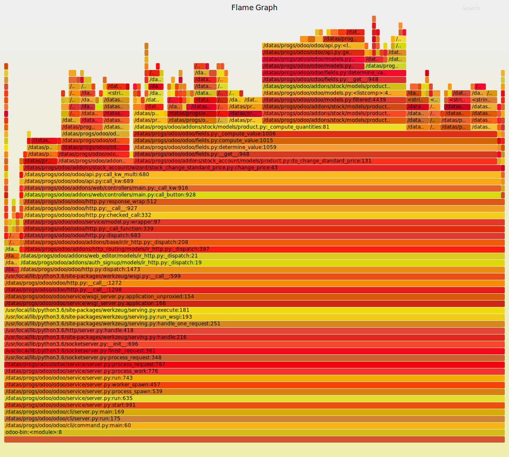

# Graph a method

## Profiler

Odoo embeds a profiler of code generates:
- graph of calls triggered by the method
- number of queries
- percentage of time taken
- time the method/sub-called methods took

## Get profiler output

```python
from odoo.tools.misc import profile
[...]
@profile('/temp/prof.profile')
def mymethod(...)
```

This produces a file called /temp/prof.profile

## Analyse ouput

A tool called gprof2dot will produce a graph with this result:

```shell
gprof2dot -f pstats -o /temp/prof.xdot /temp/prof.profile
```

A tool called xdot will display the resulting graph:

```shell
xdot /temp/prof.xdot
```

# Log a method

## Another profiler

can be used to log statistics on a method:

```python
from odoo.tools.profiler import profile
[...]
@profile
@api.model
def mymethod(...):
```

## Another profiler

The statistics will be displayed into the logs once the method to be analysed is completely reviewed

## Dump Stack

> Sending the SIGQUIT signal to an Odoo process (only available on POSIX) makes this process output the current stack trace to log, with info level.

- print stack trace in Linux

## Tracing Code Execution

Tools: Pyflame, Pygraph




